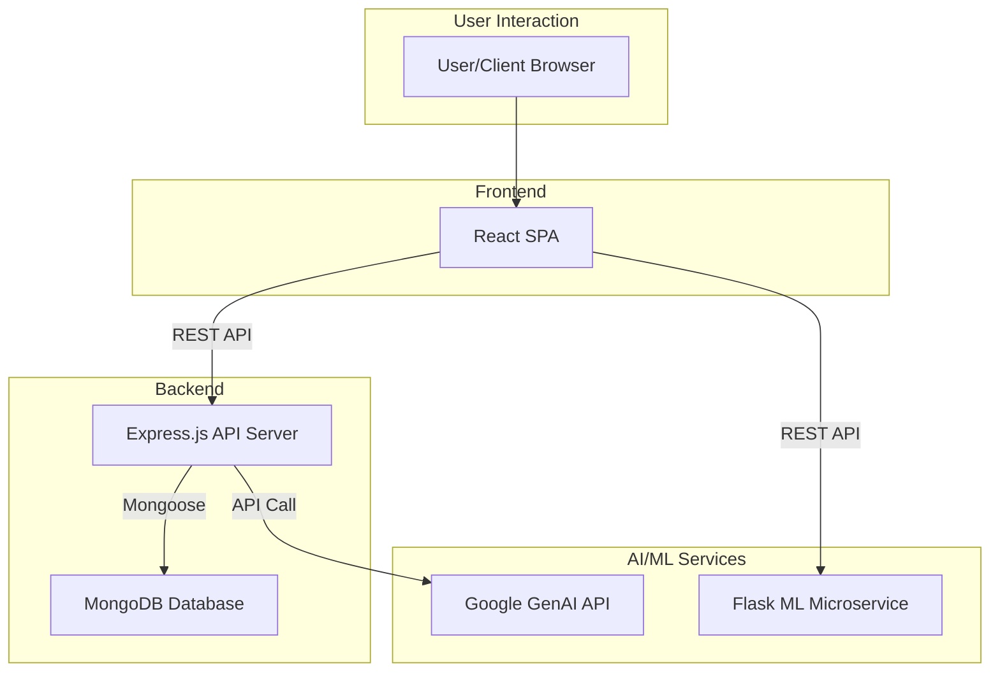
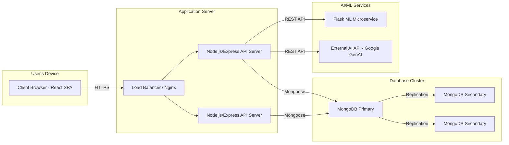

# AquaShield System Architecture 🏗️

This document provides a detailed overview of the **AquaShield Smart Community Health Surveillance System** architecture, including its components, design patterns, and data flows.

## 📋 Table of Contents

- [System Overview](#-system-overview)
- [Architecture Diagram](#️-architecture-diagram)
- [Frontend Architecture](#-frontend-architecture)
- [Backend Architecture](#-backend-architecture)
- [ML Microservice Architecture](#-ml-microservice-architecture)
- [Database Schema Design](#️-database-schema-design)
- [Authentication & Authorization Flow](#-authentication--authorization-flow)
- [Data Flow Patterns](#-data-flow-patterns)
- [API Communication](#-api-communication)
- [Security Architecture](#-security-architecture)
- [Role-Based Access Control](#-role-based-access-control)
- [AI Integration Architecture](#-ai-integration-architecture)
- [ML Pipeline Architecture](#-ml-pipeline-architecture)
- [Scalability Considerations](#-scalability-considerations)
- [Error Handling Strategy](#-error-handling-strategy)
- [Performance Optimization](#-performance-optimization)
- [Deployment Architecture](#-deployment-architecture)
- [Monitoring & Logging](#-monitoring--logging)
- [Data Backup & Recovery](#-data-backup--recovery)
- [Future Architecture Enhancements](#-future-architecture-enhancements)

## 🌐 System Overview

### High-Level Description
AquaShield is built on a **three-tier architecture** composed of:
1. **Frontend (Client)**: A modern React single-page application (SPA)
2. **Backend (Server)**: A robust Node.js/Express RESTful API
3. **Database**: A flexible MongoDB NoSQL database

Additionally, it includes a **ML Microservice** for specialized AI/ML tasks, promoting a microservices-oriented approach for scalability and separation of concerns.

### Component Interaction


### Technology Rationale
- **React**: Chosen for its component-based architecture, strong community support, and rich ecosystem, enabling rapid development of a dynamic UI.
- **Node.js/Express**: Selected for its non-blocking I/O, performance, and JavaScript ecosystem, allowing for a unified language across the stack.
- **MongoDB**: Preferred for its flexible schema, scalability, and suitability for handling diverse and evolving health data structures.
- **Python/Flask**: Ideal for ML tasks due to its extensive data science libraries and lightweight framework for creating microservices.

## 🏗️ Architecture Diagram

### Text-Based Description for Mermaid


## 🎨 Frontend Architecture

### Technology
- **Framework**: React 19.1.1 with Vite
- **State Management**: Zustand for global state (auth, user profile, AI chat)
- **Routing**: React Router v7 for client-side routing
- **Styling**: TailwindCSS 4 with a utility-first approach
- **API Communication**: Axios with interceptors for token management

### Component Structure
```
src/
├── components/   # Reusable UI components (Button, Input, Card)
├── pages/        # Top-level page components (HomePage, DashboardPage)
├── layouts/      # Layout components (MainLayout, AuthLayout)
├── services/     # API communication layer (authService, districtService)
├── hooks/        # Custom hooks (useAuth, useApi)
├── store/        # Zustand state management stores
├── utils/        # Utility functions (formatDate, validation)
├── config/       # Configuration files (apiClient)
└── App.jsx       # Main application component with routing
```

### Key Patterns
- **Functional Components**: All components are functional with hooks.
- **Custom Hooks**: Logic is encapsulated in custom hooks for reusability (e.g., `useAuth` for authentication state, `useApi` for API calls).
- **Role-Based Guards**: Higher-Order Components (HOCs) or wrapper components protect routes based on user roles.
- **Service Layer**: API logic is abstracted into a service layer, separating it from UI components.
- **Lazy Loading**: Pages and large components are lazy-loaded to improve initial load time.

### Data Flow
1. **Component Interaction**: User interacts with a component.
2. **API Call**: The component calls a function from the service layer.
3. **State Update**: The service function makes an API call, and on success/failure, updates the Zustand store.
4. **Re-render**: Components subscribed to the store re-render with the new state.

## ⚙️ Backend Architecture

### Technology
- **Framework**: Node.js with Express 5
- **Database**: MongoDB with Mongoose ODM
- **Authentication**: JWT with access and refresh tokens

### Architecture Pattern
- **MVC (Model-View-Controller)**:
  - **Models**: Mongoose schemas defining data structure and validation.
  - **Views**: Handled by the React frontend (API-only backend).
  - **Controllers**: Business logic for handling requests and interacting with models.

### Folder Structure
```
src/
├── controllers/  # Request handling and business logic
├── models/       # Mongoose data models
├── routes/       # API route definitions
├── middleware/   # Express middleware (auth, error handling, validation)
├── utils/        # Utility functions (token generation, response helpers)
├── validation/   # Joi validation schemas
├── config/       # Configuration (database, environment)
└── index.js      # Server entry point
```

### Key Patterns
- **Middleware Chain**: Requests pass through a chain of middleware (logging, auth, validation) before reaching the controller.
- **Async Error Handling**: A centralized async error handler middleware catches errors from async controllers, preventing crashes.
- **Response Helpers**: Standardized response functions (`successResponse`, `errorResponse`) ensure consistent API responses.
- **Dependency Injection**: (Lightweight) Dependencies like services can be injected into controllers for better testability.

## 🤖 ML Microservice Architecture

### Technology
- **Framework**: Python with Flask
- **ML Library**: scikit-learn
- **Data Handling**: pandas, numpy
- **Model Persistence**: joblib

### API Design
- **RESTful Endpoints**: Simple, resource-oriented endpoints for ML tasks.
- **Stateless**: The service is stateless, making it easy to scale horizontally.

### Model Management
- **Persistence**: Trained models are serialized using `joblib` and loaded at startup.
- **Versioning**: Model files are versioned to allow for easy rollback and A/B testing (future).

### Data Processing
- **Preprocessing Pipeline**: A scikit-learn pipeline is used to preprocess input data (scaling, imputation) consistently between training and prediction.

## 🗃️ Database Schema Design

### Core Collections
- **User**: Stores user profile, credentials, role, and assignments.
- **District**: Top-level administrative unit.
- **Block**: Mid-level administrative unit, child of a District.
- **Village**: Lowest-level administrative unit, child of a Block.
- **HealthReport**: Health incidents reported by ASHA workers.
- **PatientRecord**: Basic patient information.
- **VaccinationRecord**: Vaccination history for patients.
- **WaterQualityTest**: Water test results from volunteers.
- **HealthObservation**: General health observations from the community.
- **CommunityObservation**: Reports on community-level issues (e.g., sanitation).
- **PersonalHealthRecord**: User-managed health records.
- **FamilyMember**: User-managed family member profiles.
- **HealthProgram**: Health initiatives managed by Health Officers.
- **DiseaseRecord**: Tracks specific diseases for outbreak analysis.
- **AlertSystem**: Stores alerts generated by the system.

### Relationships
- **Embedding**: Used for tightly coupled, one-to-one, or one-to-few relationships (e.g., user's personal info).
- **Referencing**: Used for one-to-many or many-to-many relationships to avoid data duplication (e.g., a district has many blocks).

### Indexing Strategy
- **Single-field indexes**: On frequently queried fields like `email`, `districtId`, `status`.
- **Compound indexes**: For queries involving multiple fields (e.g., `district` and `status`).
- **Text indexes**: For search functionality on fields like `name` and `description`.
- **Geospatial indexes**: For location-based queries (future).

## 🔐 Authentication & Authorization Flow

1. **Registration**: User signs up, password is hashed with `bcrypt`, and a new user document is created.
2. **Login**:
   - User provides email and password.
   - Server validates credentials against the hashed password in the database.
   - On success, two JWTs are generated: a short-lived **access token** and a long-lived **refresh token**.
   - The access token is sent in the response body.
   - The refresh token is sent as a secure, `httpOnly` cookie.
3. **Authenticated Request**:
   - Client sends the access token in the `Authorization: Bearer <token>` header.
   - A middleware on the server verifies the token's signature and expiration.
4. **Token Expiration**:
   - If the access token is expired, the API returns a `401 Unauthorized` error.
   - The client's Axios interceptor catches this error and calls the `/api/auth/refresh` endpoint.
5. **Token Refresh**:
   - The `/refresh` endpoint receives the refresh token from the cookie.
   - It validates the refresh token and, if valid, issues a new access token.
   - The client retries the original failed request with the new access token.
6. **Logout**:
   - Client calls `/api/auth/logout`.
   - Server clears the refresh token cookie, effectively ending the session.

## 🌊 Data Flow Patterns

### Create Flow (e.g., Creating a District)
1. **Client**: User submits a form with district data.
2. **Frontend Validation**: React Hook Form validates input.
3. **API Call**: `districtService.createDistrict(data)` is called.
4. **Backend Middleware**: Request passes through `auth` (is user admin?) and `validate` (Joi schema) middleware.
5. **Controller**: `districtController.createDistrict` is executed.
6. **Model**: A new `District` model instance is created and saved to the database.
7. **Database**: The new document is inserted into the `districts` collection.
8. **Response**: The controller sends a `201 Created` response with the new district data.

### Read Flow (e.g., Fetching Blocks)
1. **Client**: User navigates to the blocks page.
2. **API Call**: `blockService.getBlocks({ page: 1, limit: 10 })` is called.
3. **Controller**: `blockController.getBlocks` handles the request.
4. **Model**: `Block.paginate(filter, options)` is used to query the database with pagination.
5. **Database**: MongoDB uses indexes to efficiently find and sort the matching documents.
6. **Transform**: The controller formats the data into the standard paginated response structure.
7. **Response**: A `200 OK` response is sent to the client with the list of blocks and pagination info.

## 📡 API Communication

- **Protocol**: RESTful API over HTTPS.
- **Data Format**: JSON for all request and response bodies.
- **Client-Side**: `axios` is used for all HTTP requests.
  - **Interceptors**: An Axios interceptor is configured to automatically add the `Authorization` header to outgoing requests and handle token refresh logic on `401` responses.
- **Server-Side**: `express.json()` middleware parses incoming JSON payloads.
- **Logging**: A middleware logs incoming requests (method, URL, status code, response time) for debugging and monitoring.

## 🛡️ Security Architecture

- **Authentication**: JWT with secure secret keys and short-lived access tokens.
- **Password Security**: `bcrypt` hashing with a salt round of 12.
- **Input Validation**: Joi schemas on all API endpoints to prevent malformed data.
- **Rate Limiting**: `express-rate-limit` middleware to mitigate brute-force and DoS attacks.
- **CORS**: `cors` middleware configured to allow requests only from the frontend origin.
- **Security Headers**: `helmet` middleware sets various HTTP headers to protect against common vulnerabilities (XSS, clickjacking, etc.).
- **XSS Protection**: Handled by React's automatic escaping of JSX content and backend input sanitization.
- **CSRF Protection**: Mitigated by using JWTs instead of session cookies for API authentication and `SameSite` attribute on the refresh token cookie.

## 🎭 Role-Based Access Control (RBAC)

- **Roles**: Defined roles (Admin, HealthOfficer, ASHAWorker, Volunteer, User) with a hierarchy of permissions.
- **Permissions Matrix**: A conceptual matrix defines which roles can perform which actions on which resources.
- **Implementation**:
  - **Frontend**: A custom `RouteGuard` component wraps routes in `App.jsx`, checking the user's role from the Zustand store before allowing access.
  - **Backend**: An `authorize` middleware is used in route definitions. It takes an array of allowed roles and checks if the authenticated user's role is included.
    ```javascript
    // Example of a protected route
    router.post('/', authorize(['Admin']), createDistrict);
    ```

## 🧠 AI Integration Architecture

- **Framework**: LangChain.js is used on the backend to orchestrate interactions with the language model.
- **Language Model**: Google GenAI (e.g., Gemini) provides the core conversational intelligence.
- **Agent-Based Approach**: A LangChain agent is created with access to "tools".
  - **Tools**: These can include a search tool for health information, a database tool to query health stats, etc.
- **Context Management**: Conversation history is managed per session to provide contextual responses.
- **Voice Integration**:
  - **Frontend**: Uses the browser's Web Speech API for speech-to-text.
  - **Backend**: The transcribed text is sent to the AI service. The response text is sent back to the client, which uses the Web Speech API for text-to-speech.

## 🧪 ML Pipeline Architecture

1. **Data Collection**: Water quality parameters are collected by volunteers and submitted via the app.
2. **Data Storage**: Test data is stored in the `waterqualitytests` collection in MongoDB.
3. **Data Preprocessing**:
   - A Python script periodically extracts data from MongoDB.
   - `pandas` is used for data cleaning (handling missing values, outliers).
   - A `scikit-learn` `Pipeline` is defined to scale numerical features (`StandardScaler`) and encode categorical features.
4. **Model Training**:
   - The preprocessed data is used to train a classification model (e.g., `RandomForestClassifier`).
   - The model is evaluated using cross-validation and metrics like accuracy, precision, and recall.
5. **Model Deployment**:
   - The trained `Pipeline` (including preprocessing steps and the model) is serialized using `joblib`.
   - The Flask microservice loads this model file at startup.
6. **Prediction Flow**:
   - The Flask API receives new water parameters.
   - The input data is transformed using the loaded pipeline.
   - The model's `predict()` or `predict_proba()` method is called.
   - The prediction result is formatted and returned as a JSON response.

## 📈 Scalability Considerations

- **Horizontal Scaling**: The backend and ML service are stateless, allowing multiple instances to be run behind a load balancer.
- **Database Optimization**:
  - **Indexing**: Proper indexing ensures efficient queries as data grows.
  - **Read Replicas**: MongoDB replica sets can be used to distribute read load.
  - **Sharding**: For very large datasets, the database can be sharded by district or region.
- **Caching**: A caching layer (e.g., Redis) can be introduced to cache frequently accessed data (e.g., district lists, user profiles) and reduce database load.
- **Microservices**: The separation of the ML service allows it to be scaled independently based on its specific resource needs.

## ⚠️ Error Handling Strategy

- **Frontend**:
  - `try...catch` blocks in API service functions.
  - React Error Boundaries to catch rendering errors in components.
  - User-friendly feedback via toast notifications for API errors.
- **Backend**:
  - A global `asyncErrorHandler` middleware wraps all async route handlers to catch promise rejections.
  - A centralized `errorHandler` middleware formats all errors into a standard JSON response.
  - Custom `ApiError` class for handling operational errors with specific status codes.

## ⚡ Performance Optimization

- **Frontend**:
  - **Code Splitting**: `React.lazy()` is used to split code by routes.
  - **Lazy Loading**: Images and off-screen components are lazy-loaded.
  - **Memoization**: `React.memo`, `useMemo`, and `useCallback` are used to prevent unnecessary re-renders.
  - **Asset Optimization**: Vite handles minification and bundling. Images are compressed.
- **Backend**:
  - **Database Indexing**: Ensures fast query performance.
  - **Pagination**: All list endpoints are paginated to limit payload size.
  - **Query Projection**: Mongoose's `select()` is used to fetch only the necessary fields from the database.

## ☁️ Deployment Architecture

- **Development**: Local servers (Vite, Express, Flask) for rapid development.
- **Staging**: A separate cloud environment that mirrors production for testing.
- **Production**:
  - **Load Balancer**: Distributes traffic across multiple application server instances.
  - **App Servers**: Backend and ML services run on separate servers or containers (e.g., AWS EC2, Docker).
  - **Database**: A managed database service (e.g., MongoDB Atlas) is recommended for reliability and backups.
  - **CI/CD**: A pipeline (e.g., GitHub Actions) automates testing and deployment on merges to the `main` branch.

## 📊 Monitoring & Logging

- **Application Logs**: `morgan` middleware for HTTP request logging. `winston` for structured, level-based application logging.
- **Error Tracking**: Integration with a service like Sentry or Rollbar to capture and alert on runtime errors.
- **Performance Monitoring**: Tools like New Relic or Datadog to monitor API response times, database performance, and server health.
- **Health Checks**: A `/api/health` endpoint provides a simple way for monitoring services to check application status.

## 💾 Data Backup & Recovery

- **Database Backups**: MongoDB Atlas provides automated, continuous backups and point-in-time recovery.
- **Backup Schedule**: Daily incremental backups and weekly full snapshots.
- **Recovery Procedures**: A documented plan for restoring the database from a backup in case of data loss.
- **Data Retention**: Backup retention policies are configured based on project requirements.

## 🔮 Future Architecture Enhancements

- **WebSocket Integration**: For real-time notifications and dashboard updates.
- **GraphQL API**: Introduce a GraphQL layer for more flexible data fetching on the frontend.
- **Redis Caching**: Implement a Redis cache for sessions, rate limiting, and frequently accessed data.
- **Message Queue**: Use a message queue (e.g., RabbitMQ, AWS SQS) for asynchronous tasks like sending emails or processing large reports.
- **Serverless Functions**: Migrate certain tasks (e.g., image resizing, scheduled jobs) to serverless functions for cost efficiency.
- **Advanced Analytics**: A dedicated data warehouse and BI tools for complex analytics.